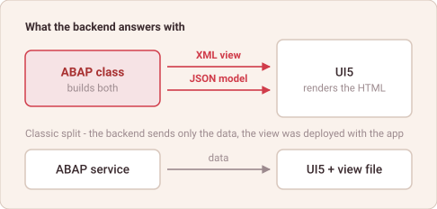

# UI5 Over-the-Wire

*abap2UI5 Know-How #5 — draft*

A UI5 freestyle app is a single-page application. The view is deployed with the
app in the frontend, the backend delivers data through OData, and the browser
puts the two together and renders the HTML.

One detail in that split is worth staring at. UI5 does not render from
JavaScript objects assembled by hand — it renders from an **XML view**, bound to
its data. The view is a document. Documents can travel.

So: what if the backend sent the view as well?

That is the entire idea. abap2UI5 answers every request with two strings. An
XML view:

```xml
<mvc:View xmlns="sap.m" xmlns:mvc="sap.ui.core.mvc">
  <Page title="abap2UI5 - Hello World">
    <Input value="{/NAME}"/>
    <Button press=".eB(['BUTTON_POST'])" text="post"/>
  </Page>
</mvc:View>
```

and the model that fills it:

```json
{ "MODEL": { "NAME": "test" } }
```



*The backend answers with a view and its model; the browser renders both.*

Nothing there is a protocol abap2UI5 invented. The XML is UI5's own view
format, the JSON is an ordinary UI5 JSON model, and the frontend does what it
has always done — build HTML from a view and its data. What changes is who owns
the view. It is no longer an artefact deployed beside the app; it is a string an
ABAP class produced for this request, and the next request may produce a
different one.

The pattern has a name outside SAP. **HTML Over-the-Wire** — the server renders,
the browser inserts, and JSON never becomes the in-between format. htmx,
Hotwire, Phoenix LiveView, Livewire and Unpoly are all built on it.

It is not a return to full-page reloads either. ITS Mobile and SAP GUI for HTML
answered every interaction with a whole document; Over-the-Wire replaces
fragments and leaves the page standing. UI5 cannot take HTML off the wire — it
renders in the browser by design — so what travels is the layer directly above
it. A view, not a page.

**The frontend stopped being an application and became a renderer. Everything
else in this series is a consequence of that one move.**

Happy ABAPing! 🦖🦕🦣

*This article and the ones that follow it are cut from
[Under the Hood of abap2UI5](https://community.sap.com/t5/technology-blog-posts-by-members/abap2ui5-7-technical-background-under-the-hood-of-abap2ui5/ba-p/13566459),
published on the SAP Community — the long version, with the diagrams.*

---

## LinkedIn teaser post

Plain text — LinkedIn renders no markdown.

> UI5 does not render from objects you assemble by hand. It renders from an XML
> view, bound to its data. The view is a document — and documents can travel.
>
> So what if the backend sent the view too? That is the whole of abap2UI5: every
> request is answered with two strings, a UI5 XML view and a UI5 JSON model.
> Neither is a protocol the framework invented, and the frontend does what it
> always did.
>
> What changes is who owns the view. Not an artefact deployed beside the app —
> a string an ABAP class produced for this request.
>
> New article 🎉
>
> Where would you draw the line between a frontend and a renderer?
>
> #ABAP #SAP #UI5
