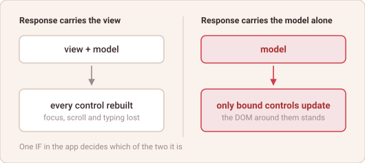

# Only the Changed Part

*abap2UI5 Know-How #8 — draft*

If the backend sends the view on every request, does the screen rebuild itself
on every click?

It would, and the user would notice. A rebuilt view is a new set of controls:
the cursor leaves the field, a half-typed entry is gone, the table scrolls back
to the top. Nobody wants to type into that.

So the view is not sent every time. Sending it is a decision the app makes:

```abap
  METHOD z2ui5_if_app~main.

    me->client = client.
    text = text && ` text`.

    IF client->check_on_navigated( ) OR partly = abap_false.
      set_view( ).
    ENDIF.
    " no ELSE - a model-only change travels with the response by itself

  ENDMETHOD.
```

When `set_view( )` is skipped, the response carries the model alone. The view
in the browser is the one already standing, and UI5 does what UI5 does with a
changed model: data binding updates the controls bound to what changed, and
touches nothing else.



*What a response carries decides what survives on the screen.*

The DOM is not rebuilt. Focus stays in the field. The scroll position holds.
The value the user is halfway through typing survives, because the input
control was never replaced — only its bound value was.

This is what the Over-the-Wire frameworks outside SAP do with HTML fragments,
and UI5 gives it for free through a mechanism that was in the framework long
before this one existed. No diffing algorithm, no virtual DOM, no reconciler —
just a model that changed and a binding that noticed.

**Sending the whole view is the exception, not the rhythm.**

Happy ABAPing! 🦖🦕🦣

---

## LinkedIn teaser post

Plain text — LinkedIn renders no markdown.

> If the backend sends the view on every request, does the screen rebuild itself
> on every click?
>
> It would — and the user would feel it. A rebuilt view is a new set of
> controls: focus lost, half-typed input gone, table scrolled back to the top.
>
> So the view is not sent every time. It is one IF in the app. When it is
> skipped, the response carries only the model, and UI5 data binding updates
> exactly the controls bound to what changed. No diffing, no virtual DOM, no
> reconciler — a mechanism UI5 has had all along.
>
> New article 🎉
>
> Where has a full re-render cost you a user's input?
>
> #ABAP #SAP #UI5
