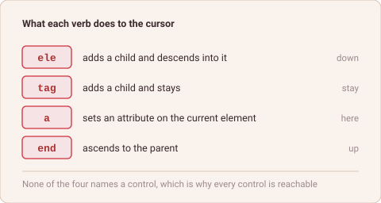

# Four Verbs

*abap2UI5 Know-How #13 — draft*

The first view builder in abap2UI5 had one method per UI5 control. `button( )`,
`input( )`, `table( )` — hundreds of them, each with the control's properties as
named parameters.

It was a good idea for a real reason. ADT code completion listed them. A
developer who did not know the UI5 API could press Ctrl-Space in the backend and
be shown what a control accepted, in ABAP, without leaving the editor. The
frontend API had been imported into the backend tooling.

It also had a hard edge. A control the class had no method for could not be
written at all. Every new UI5 control was a pull request, and a wrapper is a
translation — it can be behind, and it can be wrong, in a way the browser only
discovers at runtime.

*The four verbs, and where each one leaves the cursor in the tree.*

Its successor `z2ui5_cl_ui5_view_builder` has four verbs instead. `ele` opens an
element and descends into it, `tag` adds a child and stays, `a` sets an
attribute, `end` goes back up. Nothing in there names a control, which is
exactly why every control is reachable — including the ones released last month
and the ones nobody has wrapped.

The trade is honest: the completion list is gone. What replaced it is not
nothing, though. The chain is still ABAP, so the compiler still checks it, and
the linter checks the view against the real UI5 metadata before it ever reaches
a browser — an unknown control, a misspelled property, a member that does not
exist in the oldest supported release.

The completion list was a way to avoid reading the SDK. Coverage of the whole
API is worth more than a shortcut around part of it.

**Four verbs that know no controls can build every control.**

Happy ABAPing! 🦖🦕🦣

---

## LinkedIn teaser post

Plain text — LinkedIn renders no markdown.

> The first view builder in abap2UI5 had one method per UI5 control — hundreds
> of them, properties as named parameters. Good reason: ADT code completion
> listed them, so the frontend API was imported into backend tooling.
>
> Hard edge: a control the class had no method for could not be written at all.
> Every new UI5 control was a pull request.
>
> Its successor has four verbs — ele, tag, a, end. None of them names a control,
> which is exactly why every control is reachable. The completion list is gone;
> the compiler and the linter still check the chain.
>
> New article 🎉
>
> Wrapper or raw API — which side do you land on, and why?
>
> #ABAP #SAP #UI5
