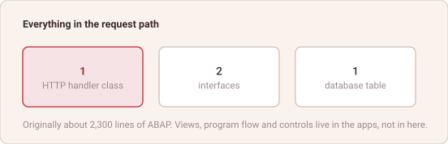

# 2,300 Lines

*abap2UI5 Know-How #18 — draft*

The communication core of abap2UI5 is one HTTP handler class, two interfaces
and one database table. Originally about 2,300 lines of ABAP. The framework has
grown since — most visibly the optional view builder — but the part that carries
every request is still that.

It is a small number, and the interesting thing is what it is small *because*
of.

*The whole request path.*

The framework does not build views; apps do. It does not decide program flow;
apps do. It does not wrap UI5 controls, so it does not grow when UI5 does. It
does not implement a protocol, because the protocol is a POST with two strings.
Most of what a framework usually accumulates lives outside this one, in the
apps, where it is written per case and not carried by everybody.

That has a consequence beyond elegance. A dependency that cannot be read cannot
really be reviewed, and a framework in the request path of a business
application is a dependency in the strongest sense — it sees every input, every
response and every user. There is a difference between trusting a package
because it is popular and being able to open it and find out. Here, one class
holds the logic, and finding out is an afternoon.

The same property is why the audit answers are short. No CDS artefacts, no RAP
objects, no generated code, no build step, no transitive package tree — the
system footprint is the source in the repository, and the source is ABAP that a
developer in the room can read.

**A framework you can read all of is a framework you can be responsible for.**

Happy ABAPing! 🦖🦕🦣

---

## LinkedIn teaser post

Plain text — LinkedIn renders no markdown.

> The communication core of abap2UI5 is one HTTP handler, two interfaces and one
> database table — originally around 2,300 lines of ABAP.
>
> It is small because of what it does not do. It does not build views, apps do.
> It does not decide flow, apps do. It does not wrap UI5 controls, so it does
> not grow when UI5 does.
>
> Which matters past elegance: a framework in the request path sees every input,
> every response, every user. There is a difference between trusting a package
> because it is popular and being able to open it and find out.
>
> New article 🎉
>
> When did you last read a framework you depend on?
>
> #ABAP #SAP #UI5
