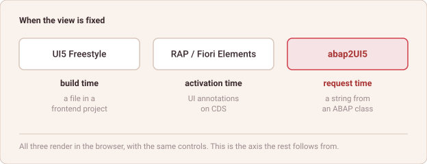

# Where the View Lives

*abap2UI5 Know-How #22 — draft*

Three ways to put a UI5 screen in front of a user on an ABAP stack. All three
render in the browser, with the same control library, through the same
framework. What differs is one thing: where the view is defined, and therefore
when it is fixed.

**UI5 Freestyle — build time.** The XML view is a file in a frontend project.
It is written in the IDE, built, and deployed alongside its controller. The
backend serves data through OData or a REST service and has no opinion about
the screen. By the time a user opens the app, the view has been fixed since the
build.

**RAP with Fiori Elements — activation time.** There is no view file per screen.
The screen is described as UI annotations on CDS entities, and a Fiori Elements
runtime in the browser turns that metadata into controls at load time. The
definition lives in the backend and is fixed when the annotations are activated.

**abap2UI5 — request time.** The view is an XML string an ABAP class produced
for this request, rendered by a shell app that is the same for every
application. It is fixed when the request is answered, and the next request may
answer differently.

*One axis: when the definition of the screen stops being changeable.*

Everything else follows from that axis. What has to be deployed per app, how
many artefacts a screen costs, what can still change at runtime, which language
the definition is written in — none of those are independent choices, they are
consequences of where the view sits.

Which is also why none of this reads as a ranking. A definition fixed early is
easier to standardise and to keep consistent across hundreds of screens. One
fixed late can adapt to things nobody knew at design time. Those are different
properties, not different amounts of the same one.

**Pick where the view lives, and most of the other decisions have already been
made for you.**

Happy ABAPing! 🦖🦕🦣

---

## LinkedIn teaser post

Plain text — LinkedIn renders no markdown.

> Three ways to get a UI5 screen in front of a user on an ABAP stack. All three
> render in the browser, same control library, same framework. What differs is
> where the view is defined — and therefore when it is fixed.
>
> UI5 Freestyle: a file in a frontend project, fixed at build time.
> RAP with Fiori Elements: UI annotations on CDS, fixed when they are activated.
> abap2UI5: an XML string an ABAP class produced for this request.
>
> Everything else follows from that axis — what gets deployed per app, what a
> screen costs in artefacts, what can still change at runtime. Not a ranking:
> fixed early standardises well, fixed late adapts well.
>
> New article 🎉
>
> Where does the view live in the app you are working on today?
>
> #ABAP #SAP #UI5
