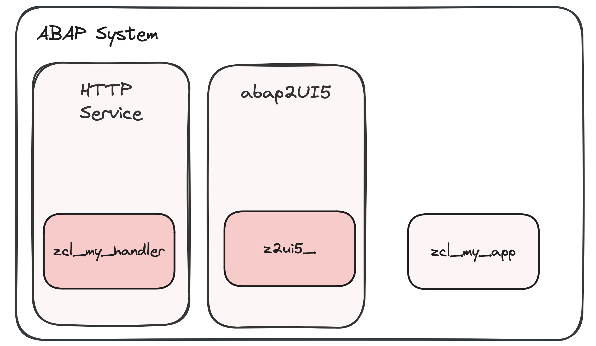
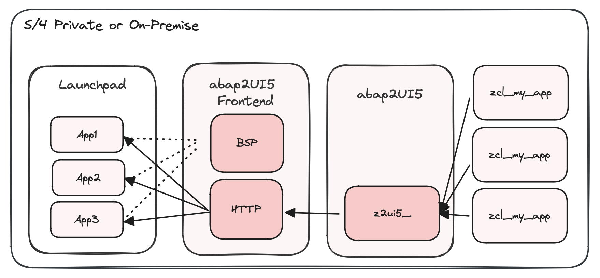
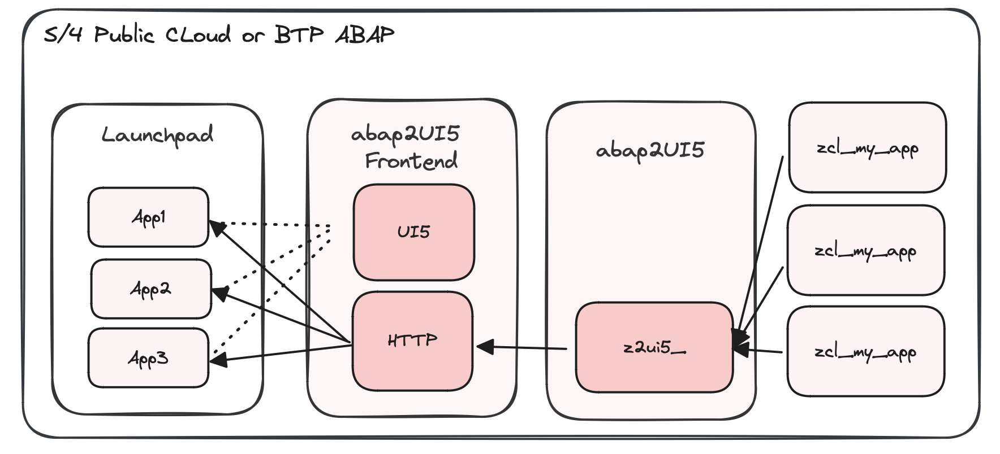

# Installation

As outlined in the Quickstart Guide, you can run the abap2UI5 and its apps directly through an HTTP service:
{ width=50% }

This is the quickest and most programmatic approach; however, for productive usage, you have additional options.

 

### ABAP Standard

In `S/4 Private` or `S/4 On-Premise` it may be required to make this app accessible via Fiori launchpad. Therefore you can install the [abap2UI5-frontend:](https://github.com/abap2UI5/frontend)

{ width=50% }

Check out this [section](/configuration/launchpad) for more details.

### ABAP Cloud 
In `S/4 Public Cloud` or `BTP ABAP Environment` you can only access the HTTP endpoint with `S_DEVELOP` authority, making this scenario unsuitable for productive usage. Therefore you need to deploy the cloud branch of the [abap2UI5-frontend](https://github.com/abap2UI5/frontend) and set up a new Fiori tile:

{ width=50% }

### R/3 Netweaver

For old `R/3 Netweaver` check out the [downport section.](/advanced/downporting)
