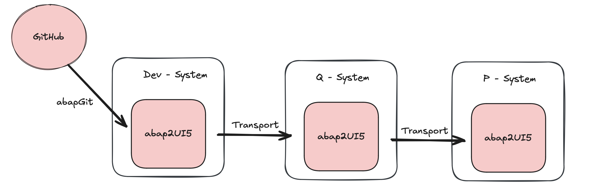

# Productive Usage

abap2UI5 is technically just an implementation of an HTTP handler and can be used as any other HTTP service in a productive scenario.

#### Preparations
You can transport abap2UI5 to production just like any other ABAP development. To ensure everything works smoothly, consider the following steps:
1. Transport the abap2UI5 HTTP service and the framework first.
2. Sometimes, extra activation of the HTTP service is needed, along with an adjustment of the UI5 bootstrapping.
3. Test the "Hello World" app to ensure that abap2UI5 works correctly.
4. Afterward, continue by transporting your custom apps.

#### Stable Version
The project will be continuously further developed. Therefore, there is no specific "stable" version. However, adjustments to the public APIs will be kept to a minimum to avoid frequent refactoring of apps. You can use the [releases](https://github.com/abap2ui5/abap2ui5/releases/) instead of pulling the main branch and update from time to time to reduce the effort needed for refactoring.

#### Transport
Install the project using abapGit into your development system. Then, use the normal transport process for deployment to production:
{ width=80% }

#### Renaming
If you're starting new development but already have abap2UI5 apps running in production, and you're concerned about updating to the latest release, consider installing abap2UI5 multiple times in your system using the [renaming feature](/advanced/renaming). This way, you can safely continue development without affecting your existing apps in production.