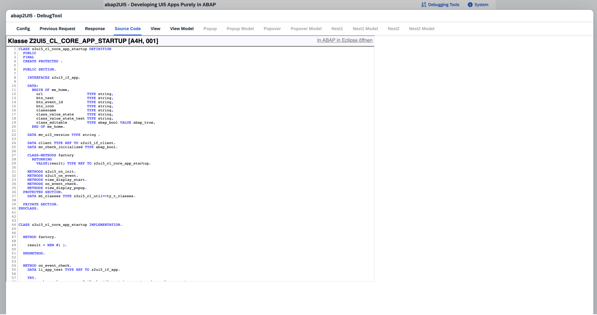

# Troubleshooting
Since all logic is written in ABAP, you can debug everything in the ABAP environment. Just make sure to set an external breakpoint, as abap2UI5 apps are called externally via HTTP.

### Backend
Set a breakpoint in your abap2UI5 app to debug your code. Verify that the XML view is generated correctly and check that all events are triggered on the backend as expected.

### Frontend
On the frontend, abap2UI5 behaves like a standard UI5 app, so you can use all typical tools and debugging features.

##### Debugging Tools
To begin, press `Ctrl+F12` to open the built-in debugger tools in abap2UI5

Here, you can inspect the XML View and check the Data Model bound to the view.

##### UI5 Inspector
Another useful option is SAP’s default debugging tool, the [UI5 Inspector.](https://chromewebstore.google.com/detail/ui5-inspector/bebecogbafbighhaildooiibipcnbngo?hl=es)

### Issues
If your code looks correct, but you suspect a bug in the abap2UI5 framework, try to create a small sample that reproduces the issue. Open an issue in the abap2UI5 repository so we can investigate and fix the bug.
