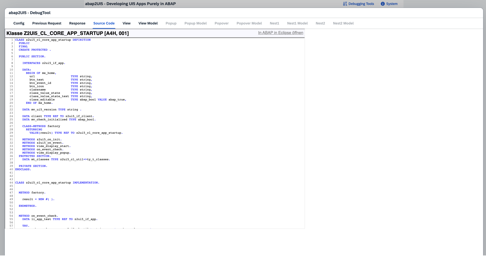

# Troubleshooting

### Backend
Set a breakpoint in your abap2UI5 app to debug your code. Verify that the XML view is generated correctly and check that all events are triggered on the backend as expected.

### Frontend
On the frontend, abap2UI5 behaves like a standard UI5 app, so you can use all typical tools and debugging features.

##### Debugging Tools
To begin, press `Ctrl+F12` to open the built-in debugger tools in abap2UI5

Here, you can inspect the XML View and check the Data Model bound to the view.

##### UI5 Inspector

Another useful option is SAP’s default debugging tool, the [UI5 Inspector.](https://chromewebstore.google.com/detail/ui5-inspector/bebecogbafbighhaildooiibipcnbngo?hl=es)

