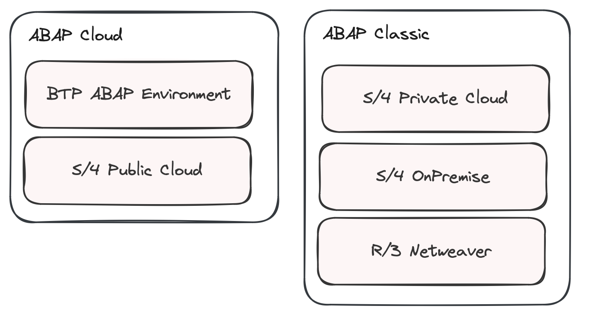
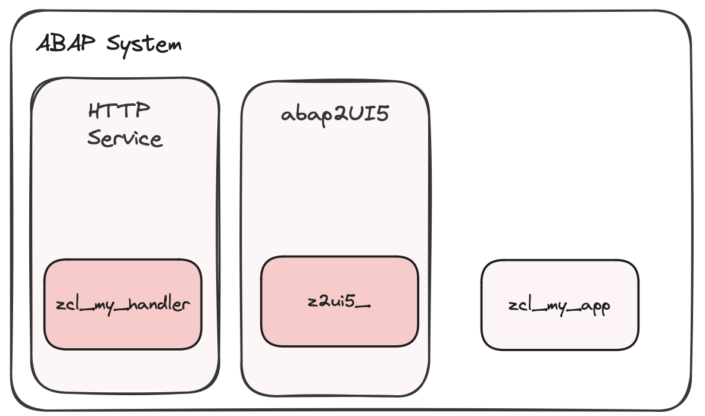

# About
Welcome to abap2UI5 – an open-source framework designed to enable UI5 app development purely in ABAP. 

##### Features
Whether you're developing in the cloud or on-premise, abap2UI5 simplifies UI5 development, making it fast and efficient without the need for JavaScript, OData, or RAP. It recalls the simplicity of classic ABAP, where just a few lines of code could generate input forms and tables using Selection Screens and ALVs.

##### Evolution
Launched in 2023 as a personal project, abap2UI5 initially focused on offering basic selection screen functionality for ABAP Cloud, introduced through a blog post on the SAP Community Network. With the support of the ABAP open-source community, it has grown significantly, adding a broad range of features. Today, abap2UI5 is a community-driven project, with contributions and feedback helping shape its development.

##### Development
Creating UI5 applications with abap2UI5 is straightforward:
1. Define a new ABAP class
2. Implement a method from the abap2UI5 interface
3. Your app is ready!

Each application is supported as an abapGit project, simplifying installation across systems without the need for extra deployment of front artifacts.

##### Architecture
abap2UI5 employs a "thin frontend" approach, handling all processing, logic, and data management in the backend. This setup simplifies configuration, minimizes client-side actions (like clearing caches), and keeps business logic and sensitive data securely on the server. The architecture also optimizes performance by leveraging server-side processing.

##### System Footprint
The abap2UI5 system footprint is kept as small as possible including only essential classes and interfaces in the base version. Additional functionality can be added by installing optional addons.

##### Compatibility
{ width=50% }
abap2UI5 is compatible with both ABAP Cloud and Standard ABAP, supporting ABAP releases from version 7.02 to ABAP for Cloud. It works on R/3 NetWeaver, S/4HANA On-Premise, S/4HANA Private Cloud, and cloud environments such as the BTP ABAP Environment and S/4HANA Public Cloud.

##### Installation
{ width=50% }
The framework consists solely of ABAP classes and interfaces, making it easy to install via abapGit, with no additional deployment steps required. You only need to create a new HTTP service to establish communication with your browser.

##### ABAP Cloud
abap2UI5 uses only released APIs, making it suitable for both on-stack and side-by-side extensions in ABAP for Cloud. You can use modern ABAP syntax features like CDS, ABAP SQL, and EML within your app.

##### ABAP Classic
The framework does not rely on newer ABAP syntax features, ensuring compatibility with on-premise and R/3 NetWeaver systems. A downported version is available for systems running ABAP versions earlier than 7.50.

##### Clean Core
By relying only on released APIs, abap2UI5 ensures that your applications remain "cloud-ready" and "upgrade-stable," aligning with SAP's clean core principles.

##### Security
Since you configure the HTTP handler yourself, you retain complete control over all external communications, ensuring security.

##### Enterprise Ready
This framework is specifically tailored to meet the needs of ABAP developers building business applications. By leveraging SAP’s UI5 framework for the frontend and adhering to clean core principles on the backend with SAP’s ABAP language, abap2UI5 provides an enterprise-ready solution compatible with a wide range of SAP products. 

##### Productive Usage
abap2UI5 can be used like any other UI5 app or ABAP program in a productive environment.

##### Launchpad
Apps developed with abap2UI5 can be integrated into Fiori Launchpads on S/4 Systems, Build Workzone websites on BTP, and tiles on S/4HANA Public Cloud.

##### Support
Support for abap2UI5 is provided by the community on a best-effort basis. If you need assistance, submit an issue or join the abap2UI5 community on Slack.

##### Contribution
Contributions are welcome! Whether through bug fixes, feature requests, or documentation improvements, your involvement helps improve abap2UI5. You can submit pull requests, provide feedback, or share your experience with the community.

##### Sponsor
abap2UI5 is maintained by volunteers. If you or your company benefit from the project but cannot contribute directly, consider supporting the project in other ways. More details are available [here.](/resources/sponsor)
