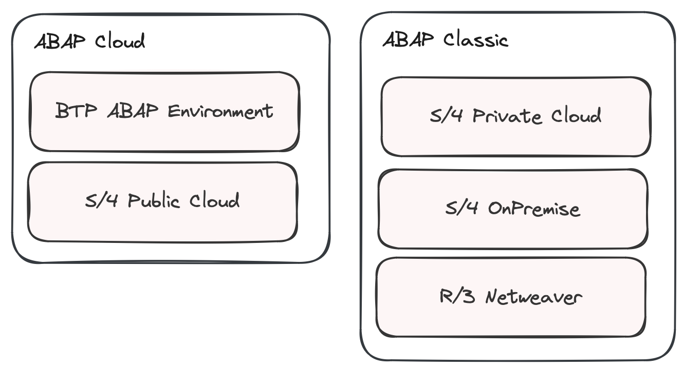

# Introduction

Welcome to abap2UI5 – an open-source project for developing UI5 apps purely in ABAP.

##### Features
abap2UI5 offers a pure ABAP approach to developing UI5 apps, without the need for JavaScript, OData, or RAP. Similar to classic ABAP, where a few lines of code were enough to display input forms and tables using Selection Screens & ALVs.

##### Evolution
Launched in 2023 as a personal project, abap2UI5 began with basic selection screen functionality for ABAP Cloud and an initial blog post on SCN. Thanks to contributions from the ABAP open-source community, the project has continuously evolved. Today, abap2UI5 boasts a wide range of features and is a thriving, community-driven initiative.

##### Compatibility
{ width=50% }
abap2UI5 runs on all ABAP releases, from NW 7.02 to ABAP Cloud. It is compatible with on-premise landscapes, including S/4HANA Private Cloud, On-Premise, and R/3 NetWeaver AS ABAP 7.50 or higher. It also works in cloud environments like BTP ABAP Environment and S/4HANA Public Cloud.

##### Installation
{ width=50% }
The framework consists only of classes and interfaces and can be easily installed via abapGit – no additional app deployment is required. To communicate with the client, you simply create a new HTTP service.

##### Development
UI5 apps are created by defining a new ABAP class and implementing a single method from the abap2UI5 interface. Each app is fully supported as an abapGit project, making installation across various systems straightforward.

##### Cloud Ready
abap2UI5 relies solely on released APIs, making it suitable for on-stack and side-by-side extensions using the new ABAP for Cloud language version. In your app implementation, you have full freedom to use new features like CDS, ABAP SQL, and EML.

##### Clean Core
By ensuring your app only uses released APIs, your development remains "cloud-ready & upgrade-stable," adhering to clean core principles and ensuring future compatibility.

##### ABAP Classic
The abap2UI5 framework does not use any newer ABAP syntax features. This makes it also compatible for on-premise and R/3 NetWeaver systems, enabling development in classic ABAP (Tier 3) extensions. A downported version is also available for systems below ABAP 7.50.

##### Architecture
The abap2UI5 system footprint is kept minimal. In its base version, it includes only the essential classes and interfaces. Additional functionality can be added by installing optional addons.

##### Security
Since you manually create the HTTP handler for client communication, you have complete control over all external interactions, ensuring security.

##### Use in Production
abap2UI5 is an implementation of an HTTP handler and can be also used like any other HTTP service in a productive environment.

##### Support
Support is provided by the community on a best-effort basis. Submit an issue or join the abap2UI5 community on Slack for help. 

##### Contribution
Contributions are always welcome. Share your knowledge, hunt for or fix bugs, submit a pull request, expand this documentation, leave a comment, or help spread the word about abap2UI5. The project thrives on your involvement!

##### Sponsor
abap2UI5 is maintained by dedicated developers volunteering their time. If you or your company use abap2UI5 in production but cannot contribute directly, consider supporting the project in other ways. More details can be found [here.](/resources/sponsor)