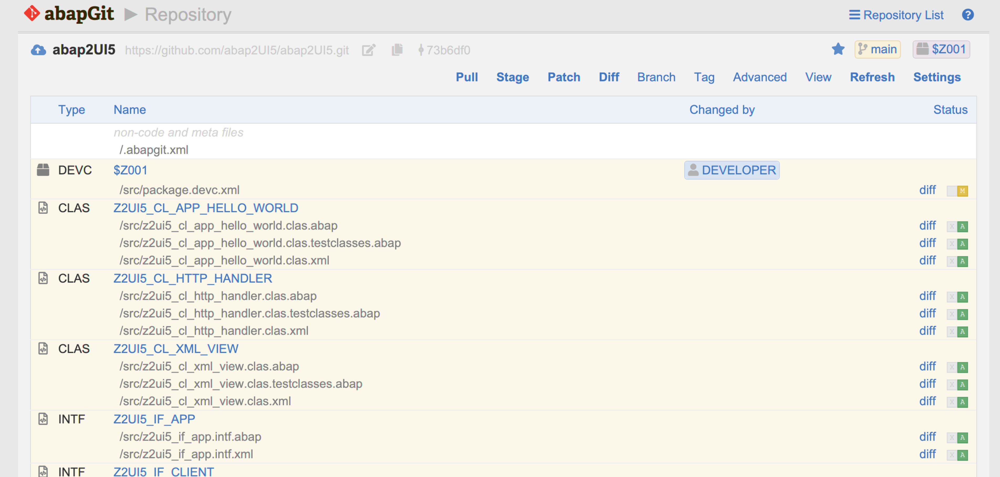
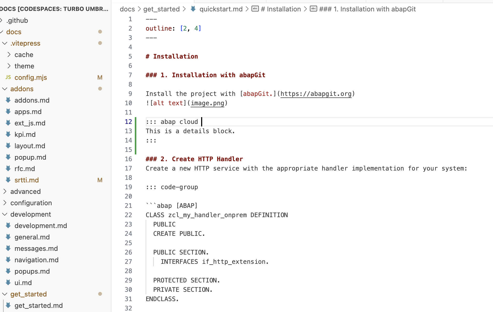

# Installation

### 1. Installation with abapGit

Install the project with [abapGit.](https://abapgit.org)


::: details S/4 Public Cloud

:::

<details>
 
</details>

### 2. Create HTTP Handler
Create a new HTTP service with the appropriate handler implementation for your system:

::: code-group

```abap [ABAP]
CLASS zcl_my_handler_onprem DEFINITION
  PUBLIC
  CREATE PUBLIC.

  PUBLIC SECTION.
    INTERFACES if_http_extension.

  PROTECTED SECTION.
  PRIVATE SECTION.
ENDCLASS.

CLASS zcl_my_handler_onprem IMPLEMENTATION.

  METHOD if_http_extension~handle_request.

    z2ui5_cl_http_handler=>factory( server )->main( ).

  ENDMETHOD.

ENDCLASS.
```

```abap [ABAP Cloud]
CLASS zcl_my_handler_cloud DEFINITION
  PUBLIC
  CREATE PUBLIC.

  PUBLIC SECTION.
    INTERFACES if_http_service_extension.

  PROTECTED SECTION.
  PRIVATE SECTION.
ENDCLASS.

CLASS zcl_my_handler_cloud IMPLEMENTATION.

  METHOD if_http_service_extension~handle_request.

    z2ui5_cl_http_handler=>factory( req = request res = response )->main( ).

  ENDMETHOD.

ENDCLASS.
```
:::

Your system structure now looks like this:
```
.
├─ abap2UI5
│─ package
│  ├─ zcl_my_handler
```


### 3. Create HTTP Endpoint
Create a new HTTP service and assign the handler implementation you created. <br>
Now, you can access abap2UI5 from your browser. The abap2UI5 framework and your custom HTTP handler have been successfully installed.<br>
Your system structure should now look like this:<br>
```
.
├─ abap2UI5
└─ package
   ├─ zcl_my_handler
   └─ icf artifact
```

### 3. Start your App
Call your HTTP service in the browser, press check, and start your app:
<br>


::: warning Information Security 💡

This project communicates solely with the HTTP handler that you define. You have complete control—decide who can access this handler and customize authentication methods. As your needs evolve, you can further refine the handler. See more details [here.](/configuration/general)

:::

