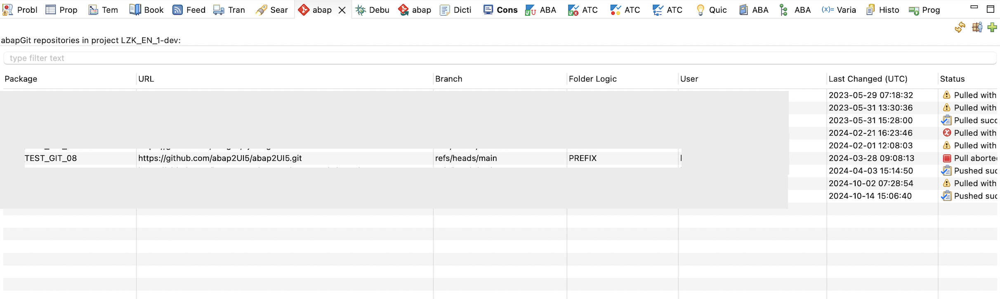
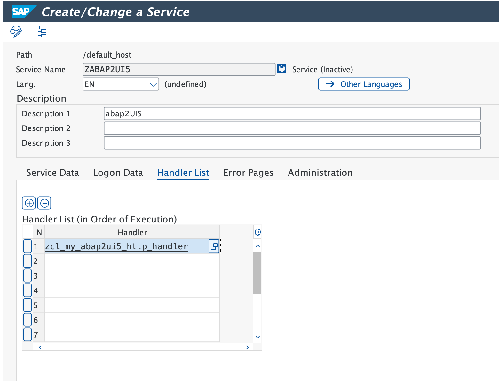

# Quickstart

### 1. Installation with abapGit

Install the project with [abapGit.](https://abapgit.org)


::: details ABAP Cloud

:::


### 2. Create HTTP Handler
Create a new package and define a new class for the HTTP handler implementation:

::: code-group

```abap [ABAP]
CLASS zcl_my_abap2UI5_http_handler DEFINITION PUBLIC CREATE PUBLIC.

  PUBLIC SECTION.
    INTERFACES if_http_extension.

ENDCLASS.

CLASS zcl_my_abap2UI5_http_handler IMPLEMENTATION.
  METHOD if_http_extension~handle_request.

    z2ui5_cl_http_handler=>run( server ).

  ENDMETHOD.
ENDCLASS.
```

```abap [ABAP Cloud]
CLASS zcl_my_abap2UI5_http_handler DEFINITION PUBLIC CREATE PUBLIC.

  PUBLIC SECTION.
    INTERFACES if_http_service_extension.

ENDCLASS.

CLASS zcl_my_abap2UI5_http_handler IMPLEMENTATION.
  METHOD if_http_service_extension~handle_request.

    z2ui5_cl_http_handler=>run( req = request res = response ).

  ENDMETHOD.
ENDCLASS.
```
:::

### 3. Create HTTP Service
Create a new HTTP service for abap2UI5. For ABAP Cloud environments, follow [this guide.](https://developers.sap.com/tutorials/abap-environment-create-http-service..html)

 <br>


::: details ABAP Cloud

:::
::: tip Security
This project communicates solely with the HTTP service you define, giving you complete control over accessibility, authentication, and other security aspects.
:::

### 4. Initial Launch
After installing the abap2UI5 framework and configuring your HTTP handler, you can access the HTTP endpoint from a web browser:

Press "Check" and launch the test app. That’s it! Now you can create a new class and start developing your own abap2UI5 applications.


