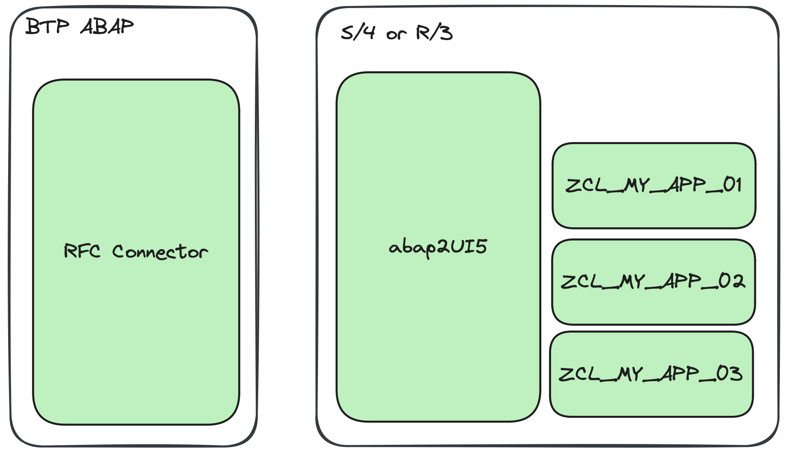

# Use Cases

abap2UI5 can be applied to a variety of use cases, whether you're working in a fully cloud-ready environment or using classic ABAP and calling unreleased APIs.

Get an overview of all possibilities in [this article.](https://www.linkedin.com/pulse/use-cases-abap2ui5-overview-abap2ui5-udbde/?trackingId=6iIX%2FNk%2BCT0%2B4JorQjpRSQ%3D%3D)

### On-Stack Extension

#### Tier 1 Extension
Development that respects the "keep the core clean" principles, ensuring your apps are cloud-ready and upgrade-stable.
{ width=60% }

#### Tier 2 Extension
If certain APIs are not yet released, you can still create a cloud-ready abap2UI5 app by calling these APIs through a separate Tier 2 wrapper:
{ width=60% }

#### Tier 3 Extension
Classic extension — use unreleased APIs and benefit from the freedom to make extensive changes to your system.
{ width=60% }

### Side-by-Side Extension

#### Tier 1 Extension
Separate the development lifecycle of your apps from your S/4 system using only remote API calls. By only using released APIs your apps are also compatible to S/4 Public Cloud.
{ width=60% }

#### Tier 3 Extension
Separate the development lifecycle of your apps from your S/4 system using only remote API calls.
{ width=60% }

### More

#### Software as a Service
Use the same code line across different S/4 systems.
{ width=60% }

#### Remote RFC
Check out the RFC Connector in the addon section:
{ width=60% }