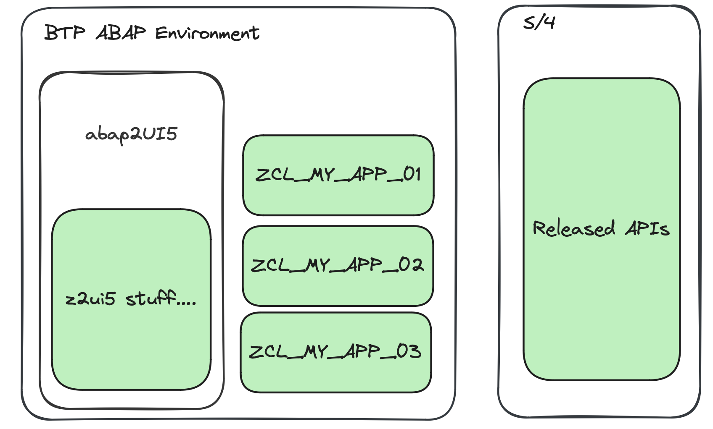

# Use Cases

abap2UI5 can be used in a variety of use cases. It’s fully cloud-ready and you can develop your apps repecting the clean core principles. Or do completely the opposite, using classic ABAP and calling in your apps everything which is not allowed anymore ;)

Check out [this article](https://www.linkedin.com/pulse/use-cases-abap2ui5-overview-abap2ui5-udbde/?trackingId=6iIX%2FNk%2BCT0%2B4JorQjpRSQ%3D%3D) to get an overview.

## On-Stack Extension

### Tier 1 Extension
{ width=70% }

### Tier 2 Extension

{ width=70% }

## Side-by-Side Extension

### Basic
{ width=70% }

### Software as a Service

{ width=70% }
