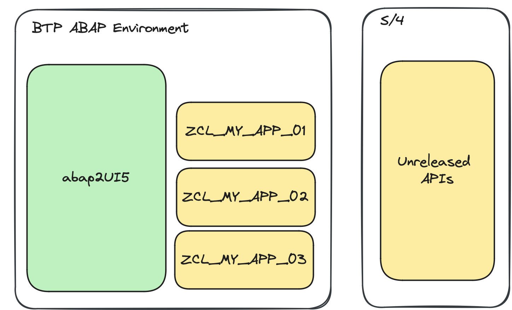

# Use Cases

abap2UI5 can be applied to a variety of use cases, whether you’re working in a fully cloud-ready environment or using classic ABAP.

Explore all possibilities in [this article.](https://www.linkedin.com/pulse/use-cases-abap2ui5-overview-abap2ui5-udbde/?trackingId=6iIX%2FNk%2BCT0%2B4JorQjpRSQ%3D%3D)

### On-Stack Extension

#### Tier 1 Extension
For clean-core compliance, develop applications that adhere to "keep the core clean" principles, ensuring that your apps are both cloud-ready and upgrade-stable:
{ width=60% }

#### Tier 2 Extension
If certain APIs you need are not yet released, you can still create a cloud-ready abap2UI5 app by accessing these APIs through a separate Tier 2 wrapper:
{ width=60% }

#### Tier 3 Extension
For a classic extension approach, you can utilize unreleased APIs, allowing greater freedom to customize and extend your system:
{ width=60% }

### Side-by-Side Extension

#### Tier 1 Extension
Develop applications separately from your S/4 system’s lifecycle using only remote API calls. By using only released APIs, your apps will also be compatible with S/4HANA Public Cloud:
{ width=60% }

#### Tier 3 Extension
For more flexibility, develop applications with an independent lifecycle from your S/4 system, while using remote API calls:
{ width=60% }

### Software as a Service
With a Tier 1 side-by-side extension, you can connect the same abap2UI5 app to multiple S/4 systems. By using the same abap2UI5 code across different customers tenants and remote systems, you create a SaaS scenario:
{ width=60% }
